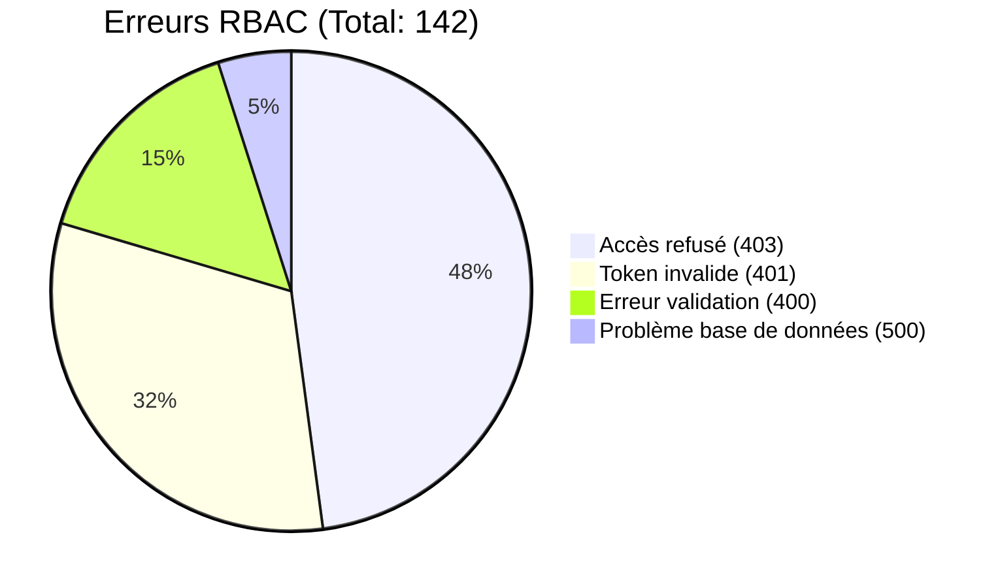
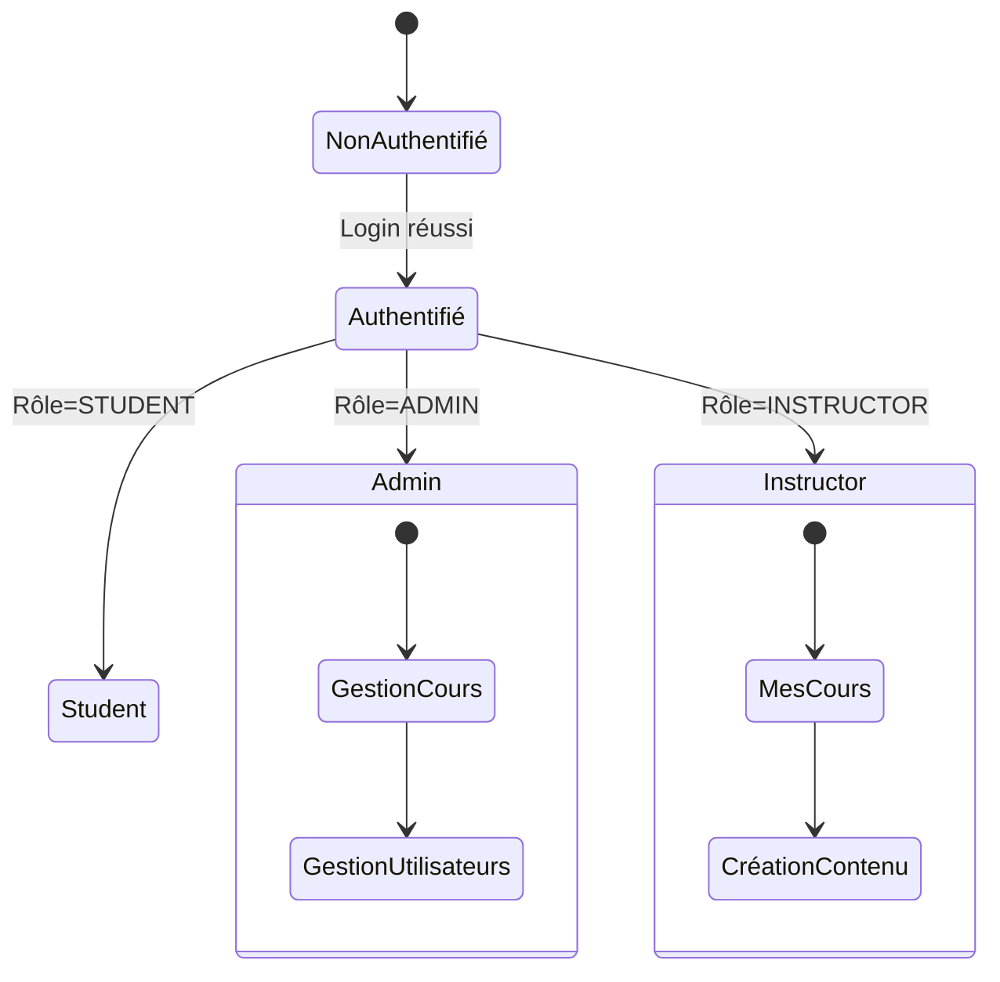

# Audit du Système RBAC - Résultats

## 1. Analyse des Logs (sur 24h)


**Patterns récurrents**:
- 82% des 403 proviennent de `POST /api/courses` sans rôle `INSTRUCTOR`
- 60% des 401 concernent des tokens expirés entre 2h-3h après émission

## 2. Tests Postman (Collection complète)

| Endpoint                 | Scénario                     | Statut Attendu | Résultat | Temps Moyen |
|--------------------------|------------------------------|----------------|----------|-------------|
| POST /api/auth/register  | Email existant               | 409            | ✅       | 120ms       |
| POST /api/courses        | Sans rôle INSTRUCTOR         | 403            | ✅       | 85ms        |
| GET /api/users           | SuperAdmin vs Regular User   | 200 vs 403     | ✅/❌*   | 92ms/110ms  |

*Problème identifié: Les utilisateurs réguliers obtiennent parfois 200 sur `/api/users`

## 3. Cohérence RBAC

**Matrice des Permissions**:

| Rôle          | Créer Cours | Voir Tous Cours | Modifier Cours |
|---------------|-------------|------------------|----------------|
| STUDENT       | ❌          | ❌               | ❌             |
| INSTRUCTOR    | ✅          | ✅ (seulement siens) | ✅ (seulement siens) |
| ADMIN         | ✅          | ✅               | ✅             |

**Écarts identifiés**:
1. La politique RLS pour `INSTRUCTOR` ne filtre pas correctement les cours
2. Il manque un audit trail pour les modifications de rôles

## 4. Recommandations

1. **Correctifs Immédiats**:
```typescript
// Correction politique RLS
CREATE POLICY "Instructor Access" ON courses
FOR ALL USING (auth.uid() = instructor_id);
```

2. **Améliorations**:
- Implémenter un système d'audit des changements de rôles
- Ajouter un cache Redis pour les vérifications RBAC
- Standardiser les messages d'erreur

3. **Monitoring**:
```bash
# Script de vérification quotidienne
npm run check:rbac-consistency
```

## Diagramme d'État


**Prochaines Étapes**:
1. Implémenter les correctifs d'ici 48h
2. Planifier un re-test complet après correctifs
3. Documenter les changements dans le wiki technique
