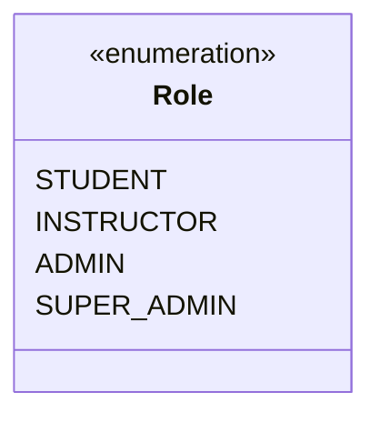
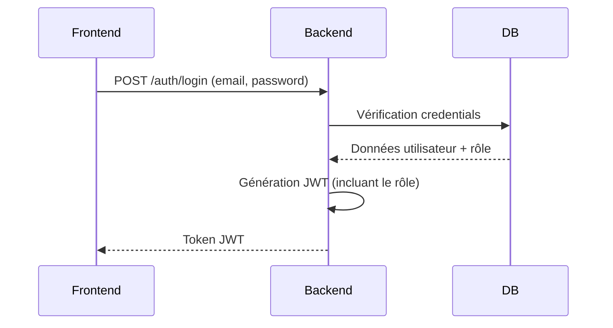

# Analyse du Système LMS

## 1. Fonctionnalités Existantes

### Rôles Implémentés


**Capacités par Rôle**:

| Rôle          | Fonctionnalités Clés                          | Restrictions                     |
|---------------|-----------------------------------------------|----------------------------------|
| STUDENT       | - Consultation cours                          | Pas de création/modification     |
|               | - Soumission exercices                        | Accès limité aux contenus        |
|               | - Suivi progression                           |                                  |
| INSTRUCTOR    | - Création/mise à jour cours                  | Seulement ses propres cours      |
|               | - Gestion étudiants                           | Pas d'accès admin               |
|               | - Évaluation travaux                          |                                  |
| ADMIN         | - Gestion complète des cours                  | Pas de modification RBAC         |
|               | - Gestion utilisateurs                        |                                  |
| SUPER_ADMIN   | - Configuration système                       | Aucune restriction              |
|               | - Gestion RBAC                                |                                  |

## 2. Flux d'Authentification et d'Autorisation

### Processus de Connexion


### Mécanisme d'Autorisation
**Middleware RBAC**:
```typescript
// Exemple de vérification de rôle
const requireRole = (role) => {
  return (req, res, next) => {
    if (req.user.role !== role) {
      return res.status(403).json({ error: 'Accès refusé' });
    }
    next();
  };
};
```

**Exemples de Restrictions**:
1. **Endpoint Cours**:
```typescript
router.post('/courses', 
  authMiddleware, 
  requireRole('INSTRUCTOR'), 
  courseController.createCourse
);
```

2. **Politique RLS**:
```sql
CREATE POLICY "Instructor Content Access" 
ON contents
FOR ALL USING (
  auth.uid() IN (
    SELECT instructor_id 
    FROM courses 
    WHERE id = course_id
  )
);
```

## Diagramme d'Interaction Complet
```svg
<svg viewBox="0 0 800 600" xmlns="http://www.w3.org/2000/svg">
  <!-- Titre -->
  <text x="400" y="30" font-family="Arial" font-size="20" text-anchor="middle" font-weight="bold">Flux d'Autorisation</text>
  
  <!-- Composants -->
  <rect x="100" y="100" width="120" height="60" fill="#e6f3ff" stroke="#0066cc" rx="5"/>
  <text x="160" y="130" font-family="Arial" font-size="14" text-anchor="middle">Client</text>
  
  <rect x="350" y="100" width="120" height="60" fill="#ffe6cc" stroke="#ff9900" rx="5"/>
  <text x="410" y="130" font-family="Arial" font-size="14" text-anchor="middle">API</text>
  
  <rect x="600" y="100" width="120" height="60" fill="#f0f0f0" stroke="#666" rx="5"/>
  <text x="660" y="130" font-family="Arial" font-size="14" text-anchor="middle">DB</text>
  
  <!-- Flux -->
  <path d="M160 160 Q260 200 350 160" stroke="#0066cc" stroke-width="2" fill="none" marker-end="url(#arrow)"/>
  <text x="255" y="190" font-family="Arial" font-size="12">Requête (JWT)</text>
  
  <path d="M470 160 Q540 200 600 160" stroke="#0066cc" stroke-width="2" fill="none" marker-end="url(#arrow)"/>
  <text x="535" y="190" font-family="Arial" font-size="12">Vérification RBAC</text>
  
  <path d="M600 160 Q540 250 470 220" stroke="#009900" stroke-width="2" fill="none" marker-end="url(#arrow)"/>
  <text x="535" y="240" font-family="Arial" font-size="12">Données filtrées</text>
  
  <path d="M350 220 Q260 250 160 220" stroke="#009900" stroke-width="2" fill="none" marker-end="url(#arrow)"/>
  <text x="255" y="240" font-family="Arial" font-size="12">Réponse</text>
  
  <!-- Scénarios -->
  <rect x="100" y="350" width="600" height="200" fill="#f8f8f8" stroke="#666" rx="5"/>
  <text x="400" y="375" font-family="Arial" font-size="16" text-anchor="middle" font-weight="bold">Exemples de Restrictions</text>
  
  <text x="150" y="400" font-family="Arial" font-size="12">• STUDENT: GET /courses ✅</text>
  <text x="150" y="420" font-family="Arial" font-size="12">• STUDENT: POST /courses ❌ (403)</text>
  <text x="150" y="440" font-family="Arial" font-size="12">• INSTRUCTOR: GET /courses/mine ✅</text>
  <text x="150" y="460" font-family="Arial" font-size="12">• INSTRUCTOR: DELETE /users ❌ (403)</text>
  <text x="150" y="480" font-family="Arial" font-size="12">• ADMIN: POST /courses ✅</text>
  <text x="150" y="500" font-family="Arial" font-size="12">• ADMIN: PUT /system/config ❌ (403)</text>
  
  <defs>
    <marker id="arrow" viewBox="0 0 10 10" refX="10" refY="5" markerWidth="6" markerHeight="6" orient="auto">
      <path d="M0 0 L10 5 L0 10 z" fill="#0066cc"/>
    </marker>
  </defs>
</svg>
```

## Problèmes Identifiés
1. **Incohérences RBAC**:
   - Certains endpoints ADMIN acceptent les INSTRUCTORs
   - Pas de validation hiérarchique des rôles

2. **Performances**:
   - Vérifications RBAC multiples par requête
   - Pas de cache pour les permissions

3. **Sécurité**:
   - Tokens JWT trop longs (3h)
   - Pas de journalisation des accès refusés

## Recommandations
1. **Correctifs Immédiats**:
```typescript
// Ajouter la hiérarchie des rôles
const roleHierarchy = {
  SUPER_ADMIN: ['ADMIN', 'INSTRUCTOR', 'STUDENT'],
  ADMIN: ['INSTRUCTOR', 'STUDENT'],
  INSTRUCTOR: ['STUDENT']
};
```

2. **Améliorations**:
   - Implémenter un cache Redis pour les permissions
   - Réduire la durée des tokens JWT (1h)
   - Ajouter un audit log des accès

3. **Tests**:
```bash
# Nouveaux tests d'intégration
npm test security/rbac
```
